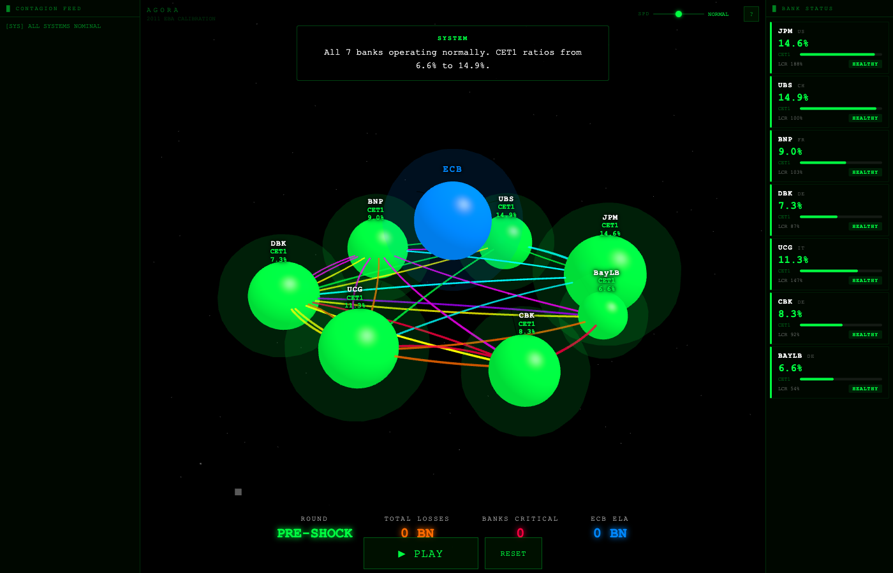
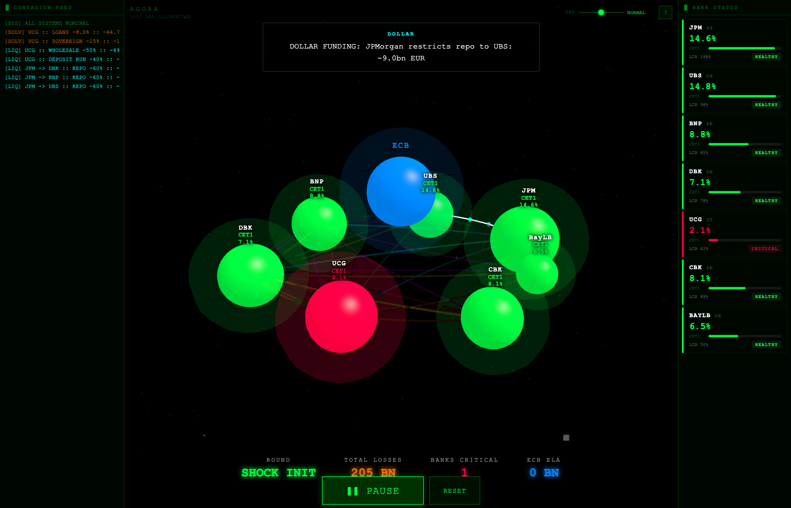
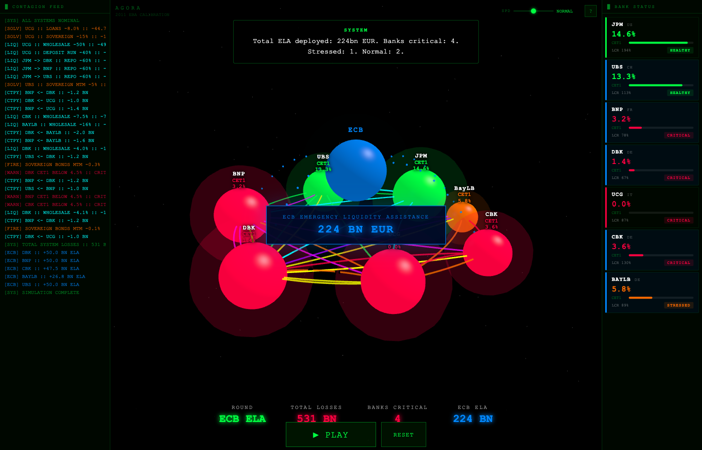

[](https://python.org)
[](https://fastapi.tiangolo.com)
[](https://vuejs.org)
[](https://isocpp.org)
[](https://www.opengl.org)
[](LICENSE)
[](https://github.com/Leotaby/Agora/actions)
[](https://leotaby.github.io/Agora)

# AGORA - Agent-Based Banking Stability Simulator

Agent-based simulation of systemic risk and contagion in European interbank networks.

## Screenshots

**Pre-shock network: all banks healthy (2011 calibration)**


**Contagion cascade: UniCredit shock spreading through the network**


**ECB intervention: 224bn EUR Emergency Liquidity Assistance deployed**


## Scientific question

How do solvency and liquidity shocks propagate through interbank networks? When does central bank intervention prevent systemic collapse, and by how much? These are the questions that reduced-form panel econometrics cannot answer, because they require a structural model with explicit network topology, heterogeneous bank balance sheets, and endogenous feedback loops between asset prices, funding markets, and capital adequacy.

## Motivation

My MSc thesis at Federico II di Napoli estimated macro-financial feedback effects across the EA-20 from 2000 to 2022 using two-way fixed effects and System-GMM on a panel of 20 eurozone economies. One core finding was that a 1 percentage point rise in unemployment causes a 1.25pp increase in non-performing loan ratios, with a multiplier that varies significantly across core and periphery countries. AGORA asks the follow-up question: what happens when those NPL losses concentrate in a single nationally important bank and cascade through the interbank network? The thesis gave the elasticity. This simulator gives the propagation mechanism.

## Counterfactual result: ECB lender of last resort (2011 Italian sovereign crisis)

Scenario: 8% loan writedown, 15% BTP haircut, 40% corporate deposit run, and 50% wholesale funding freeze on UniCredit, with JPMorgan restricting dollar repo to all European counterparties and UBS marking down European sovereign holdings.

|                         | With ECB       | Without ECB    | Delta           |
|-------------------------|----------------|----------------|-----------------|
| Total system losses     | 531 bn EUR     | 815 bn EUR     | +284 bn EUR     |
| Contagion rounds        | 11             | 20             | +9              |
| Banks at CET1 ~ 0%     | 1 (UCG)        | 4 (DBK, BNP, UCG, CBK) | +3     |
| ECB ELA deployed        | 224 bn EUR     | 0              | -224 bn EUR     |

The ECB's lender-of-last-resort function prevented 3 additional bank failures and 284 bn EUR in system losses by breaking the confidence-fire sale feedback loop.

## Contagion channels

1. **Counterparty losses.** Banks that lent to stressed or failed banks take direct write-downs on interbank exposure, proportional to the borrower's probability of default.
2. **Liquidity withdrawal.** Wholesale funding markets freeze for banks connected to stressed counterparties, as guilt-by-association causes repo and commercial paper investors to pull back.
3. **Fire sales.** Stressed banks dump sovereign bonds to rebuild LCR buffers, and the forced selling depresses prices, causing mark-to-market losses across all banks holding the same asset class.
4. **Confidence contagion.** CDS spreads from stressed banks infect connected neighbours through the interbank graph, raising funding costs and pushing marginal banks toward insolvency.
5. **Dollar funding freeze.** JPMorgan restricts secured dollar repo lines to all European borrowers when sovereign risk spikes, draining reserves from banks that depend on cross-border dollar funding.

## Data calibration (2011)

The five eurozone banks are calibrated to real published data from Q4 2011, not synthetic parameters. Sources:

- Deutsche Bank Financial Report 2011
- BNP Paribas Annual Report 2011
- UniCredit Annual Report 2011
- Commerzbank Annual Report 2011
- BayernLB Annual Report 2011
- EBA Capital Exercise December 2011
- BIS Consolidated Banking Statistics Q4 2011

UBS and JPMorgan retain synthetic balance sheets (they were not part of the EBA exercise).

## Bank network

| Bank           | Country | Assets (bn EUR) | CET1 (2011) | LCR (2011) | Italian sov. (bn EUR) | Post-shock outcome         |
|----------------|---------|------------------|-------------|------------|-----------------------|----------------------------|
| JPMorgan Chase | US      | 3,550            | 15.3%       | 187.9%     | 0.0                   | Survived unaided           |
| UBS            | CH      | 1,550            | 14.9%       | 100.3%     | 0.0                   | Survived unaided           |
| BNP Paribas    | FR      | 1,465            | 6.3%        | 63.3%      | 21.3                  | Critical, ECB ELA required |
| Deutsche Bank  | DE      | 1,164            | 5.3%        | 55.0%      | 8.1                   | Critical, ECB ELA required |
| UniCredit      | IT      | 926              | 6.4%        | 128.5%     | 47.0                  | CET1 wiped to 0%          |
| Commerzbank    | DE      | 538              | 7.5%        | 77.3%      | 10.2                  | Critical, ECB ELA required |
| BayernLB       | DE      | 302              | 6.2%        | 50.9%      | 2.5                   | Stressed, ECB ELA required |

## Architecture

```
backend/          Python contagion engine, bank models, FastAPI server
  app/models/     Bank balance sheets, interbank network graph, calibration data
  app/services/   Five-channel contagion propagation with ECB intervention logic
  app/api/        REST endpoints for per-round simulation snapshots
  scripts/        Standalone simulation runner with counterfactual experiment
frontend/         Vue 3 + D3 interactive dashboard for network visualization
visualizer/       C++17/OpenGL native 3D renderer for the contagion cascade
docs/             GitHub Pages site with Three.js 3D demo
```

## Quick start

```bash
cd backend && uv sync
python scripts/run_banking_sim.py
uv run python run.py
```

## Research agenda

| # | Working title | Target journal |
|---|--------------|----------------|
| 1 | Endogenous contagion and central bank intervention in European interbank networks | Journal of Financial Stability |
| 2 | Calibrating agent-based banking models to supervisory data | Journal of Banking and Finance |
| 3 | Counterfactual OMT: what if Draghi had not acted | Journal of International Money and Finance |

## Connection to MSc thesis

The macro-financial elasticities estimated in the MSc thesis provide the exogenous shock calibration for this simulator. The thesis repo is at [github.com/Leotaby/macro-panel-thesis](https://github.com/Leotaby/macro-panel-thesis).

## Author

Hatef Tabbakhian (Leo)
MSc Economics and Finance, Universita Federico II di Napoli

## License

AGPL-3.0
