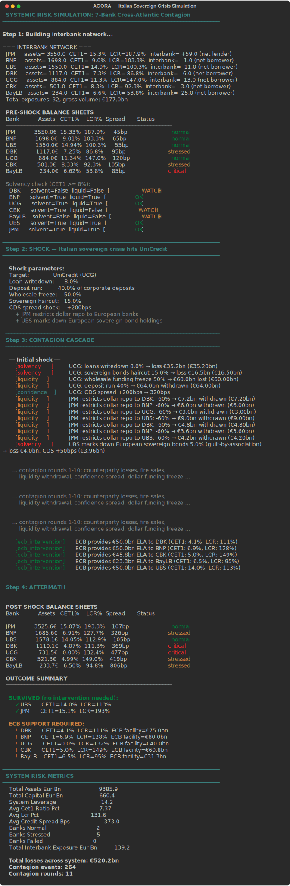

# AGORA

**Agent-based contagion simulation in European interbank networks**

[](https://python.org)
[](https://fastapi.tiangolo.com)
[](https://vuejs.org)
[](LICENSE)

---

<p align="center">
  
</p>

AGORA models how a localized banking shock propagates through a cross-Atlantic interbank network to produce systemic crisis. Seven banks are represented as fully specified balance sheets (assets, liabilities, capital, liquidity buffers) connected by directed overnight and term lending relationships. Contagion transmits through five channels until either equilibrium or central bank intervention. The project grew out of MSc thesis work on Eurozone bank stability at Federico II di Napoli and is being developed toward a PhD application at GSEFM Frankfurt.

**Scientific question.** Under what conditions does the failure of a single nationally important bank cascade into a system-wide crisis requiring central bank intervention, and how do cross-border dollar funding dependencies amplify European contagion?

## Key result

Italian sovereign crisis scenario: 15% BTP haircut, 40% corporate deposit run, 50% wholesale funding freeze on UniCredit, with JPMorgan restricting dollar repo to all European counterparties and UBS marking down European sovereign holdings.

| Bank | Country | Assets (bn EUR) | Pre-shock CET1 | Pre-shock LCR | Post-shock outcome |
|------|---------|-----------------|----------------|---------------|--------------------|
| JPMorgan Chase | US | 3,550 | 15.3% | 188% | Survived unaided |
| BNP Paribas | FR | 1,698 | 9.0% | 103% | ECB support, 80bn ELA |
| UBS | CH | 1,550 | 14.9% | 100% | Survived unaided |
| Deutsche Bank | DE | 1,117 | 7.3% | 87% | ECB support, 75bn ELA |
| UniCredit | IT | 884 | 11.3% | 147% | Capital wiped to 0% CET1 |
| Commerzbank | DE | 501 | 8.3% | 92% | ECB support, 61bn ELA |
| BayernLB | DE | 234 | 6.6% | 54% | ECB support, 31bn ELA |

Total system losses: 520bn EUR across 264 contagion events over 10 rounds. Five of seven banks required emergency liquidity assistance. The dollar funding channel (JPMorgan restricting secured repo to European banks) amplified the crisis by draining 38bn EUR from European bank reserves in the initial shock alone.

## Contagion channels

1. **Counterparty losses.** Banks that lent to stressed or failed banks take direct write-downs on interbank exposure, proportional to the borrower's probability of default.
2. **Liquidity withdrawal.** Wholesale funding markets freeze for banks connected to stressed counterparties. Guilt-by-association causes repo and commercial paper markets to close.
3. **Fire sales.** Stressed banks dump sovereign bonds to rebuild LCR buffers. Forced selling depresses prices, causing mark-to-market losses across all banks holding the same assets.
4. **Confidence contagion.** CDS spreads from stressed banks infect connected neighbors. Wider spreads raise funding costs and push marginal banks toward insolvency.
5. **Dollar funding freeze.** JPMorgan restricts secured dollar repo lines to all European borrowers when sovereign risk spikes. European banks that depend on dollar funding lose reserves immediately.

## Simulation output

The default scenario is an Italian sovereign crisis. UniCredit takes a 15% BTP haircut, loses 40% of corporate deposits and 50% of wholesale funding. JPMorgan restricts dollar repo to all European counterparties. UBS marks down its European sovereign bond portfolio. The contagion engine then propagates losses through the interbank network across 5 channels for 8 rounds until the ECB intervenes.

Results from the 7-bank network:

- Total system losses: 439.8bn EUR
- UniCredit capital wiped to 0% CET1
- JPMorgan and UBS survived unaided
- Five European banks (Deutsche Bank, BNP Paribas, Commerzbank, UniCredit, BayernLB) required ECB emergency liquidity assistance totaling 528.8bn EUR
- 8 rounds of contagion across counterparty, liquidity, fire sale, confidence, and dollar funding channels before equilibrium

## Quick start

```bash
cd backend && uv sync
python scripts/run_banking_sim.py
uv run python run.py
```

## Architecture

```
backend/
  app/
    models/
      bank.py                 # Balance sheets, capital, liquidity, 7 preset banks
      interbank_network.py    # Directed weighted lending graph, network queries
      shock.py                # Macro shock definitions
    services/
      contagion_engine.py     # Five-channel contagion propagation + ECB intervention
    api/
      banking_routes.py       # Simulation API (per-round snapshots for frontend replay)
      routes.py               # Health check, network graph endpoint
frontend/
  src/views/
    BankingView.vue           # D3 force-directed network graph, contagion timeline
```

## Target publications

| # | Working title | Target journal |
|---|--------------|----------------|
| P1 | Systemic risk transmission in heterogeneous banking networks: an agent-based approach | Journal of Financial Stability |
| P2 | Cross-border dollar funding and European contagion amplification | Journal of Money, Credit and Banking |
| P3 | Central bank intervention thresholds in simulated banking crises | Journal of Banking and Finance |

## Author

Hatef Tabbakhian (Leo)
  
MSc Economics and Finance, Universita Federico II di Napoli

## License

AGPL-3.0
